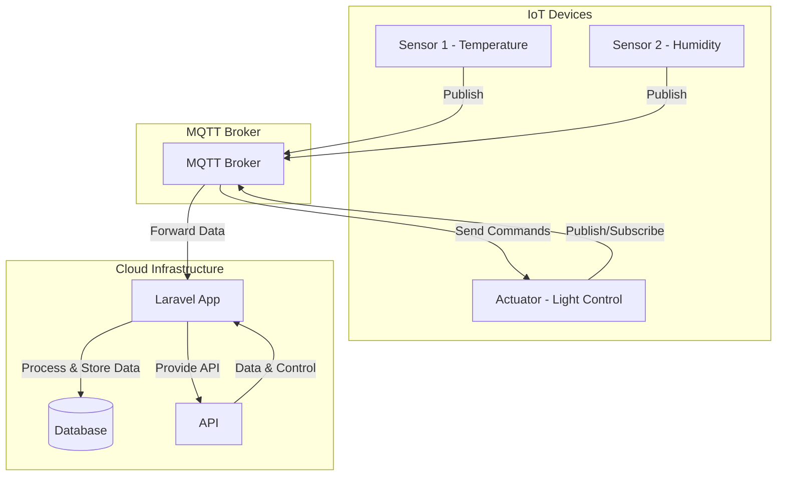
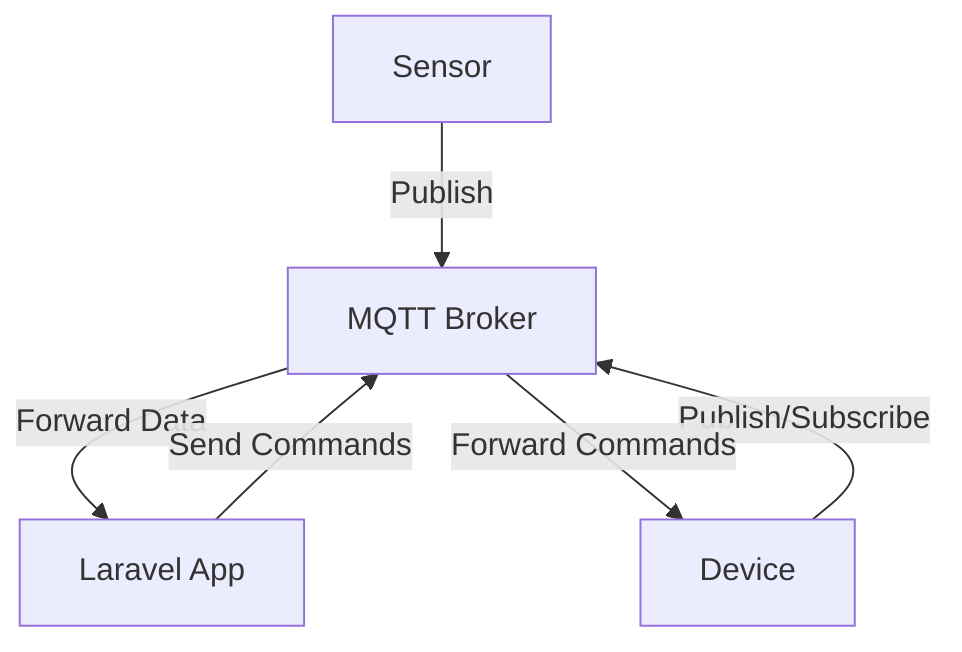

# IoTCloudSync

IoTCloudSync is a modern IoT cloud platform designed for seamless device communication and data management. Utilizing MQTT for efficient message
brokering, the platform leverages Laravel's robust framework, enhanced by Livewire, Tailwind CSS, Alpine.js, and Jetstream, to offer a responsive
and dynamic user experience. The platform provides real-time data visualization, device management, and secure API integrations, making it the ideal
solution for connecting and controlling IoT devices in a cloud environment.

